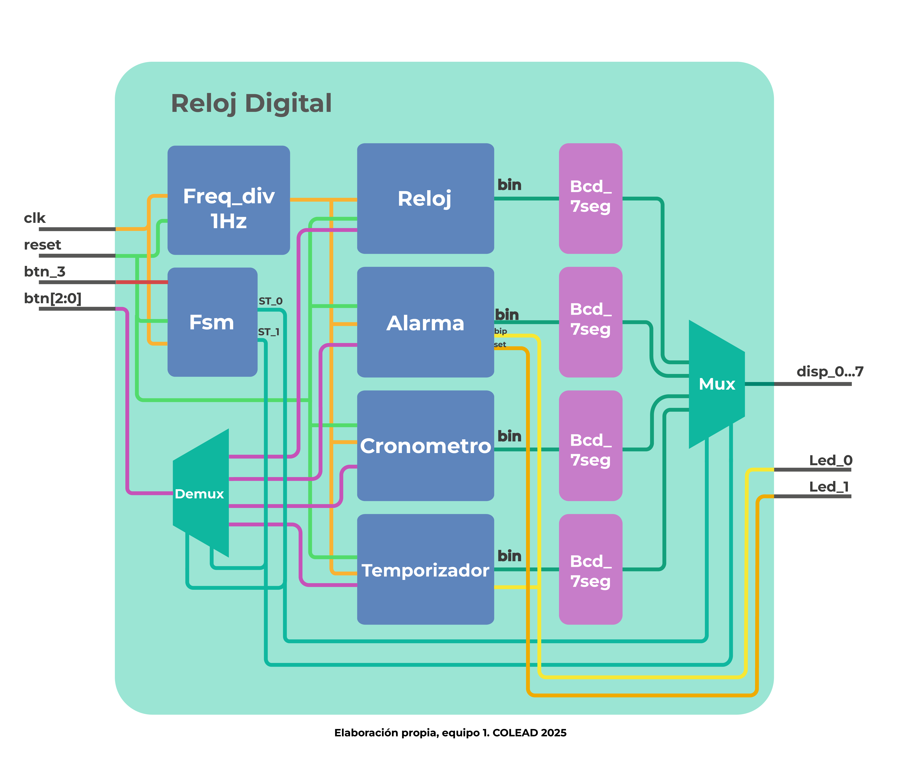

# Digital Clock

## 📌 Overview
**Digital Clock** is a Casio-style digital clock fully implemented in **Verilog HDL** and verified on a **Terasic DE1-115 FPGA development board**.  
The system integrates multiple time-related functionalities—real-time clock, alarm, stopwatch, and countdown timer—under a unified, modular, and deterministic digital architecture.

This project was developed with an educational and competitive focus, emphasizing modularity, hardware reuse, and clean state-based control.

---

## 🧩 Features
- ⏰ Real-time clock with **12-hour and 24-hour formats**
- 🌗 AM / PM indication
- ⏱ Stopwatch (MM:SS:cs format)
- ⏲ Countdown timer
- ⏰ Alarm with visual and buzzer indicators
- 🎛 User interface based on **4 physical buttons**
- 🔢 Output to 8 7-segment diplays
- 💡 LED indicators:
  - Alarm enabled
  - Alarm / timer buzzer simulation

---

## 🧠 System Architecture
The system is composed of independent functional modules coordinated by a global **Mealy-type Finite State Machine (FSM)**.  
This approach guarantees isolated operation, predictable behavior, and conflict-free user interaction.

### Main Modules
- `clock` – Real-time clock core
- `alarm` – Alarm configuration and monitoring
- `cronometer` – Stopwatch
- `temp` – Countdown timer
- `fsm` – Mode controller
- `freq_divider` – Clock generation
- Display interface and routing logic

---

## 🧩 Block Diagram

The following diagram shows a **high-level architectural overview** of the system.
It is intentionally simplified to highlight module interaction and data flow,
rather than internal implementation details.

---

## ⏰ Clock Module
The `clock` module constitutes the heart of the system and performs continuous time counting using a **1 Hz clock** generated by the frequency divider.

### Responsibilities
- Seconds, minutes, and hours counting
- 12 h / 24 h format selection
- AM / PM logic
- Hour and minute adjustment via buttons
- BCD output reused by the alarm module

The clock **never stops running**, even when other modes are active, ensuring global time consistency.

---

## ⏰ Alarm Module
The `alarm` module allows the user to store a target alarm time and continuously compares it with the current clock output.

- Generates `alarm_flag` when the times match
- Activates LED and buzzer indicators
- Configuration only allowed in Alarm mode
- Alarm remains active after exiting configuration mode

---

## ⏱ Stopwatch (Cronometer)
The `cronometer` module implements an ascending time counter in the format:

- Driven by a **1 kHz clock**
- Implemented using chained BCD counters
- Supports start, pause, and reset operations
- Provides fine time resolution without external hardware

---

## ⏲ Timer Module
The `temp` module performs a countdown from a user-defined initial value.

- Based on BCD down-counters
- Configuration only allowed while stopped
- When reaching `00:00:00`, asserts `flag_done`
- Uses the same 1 kHz time base as the stopwatch

---

## 🔁 Finite State Machine (FSM)
A global Mealy-type FSM determines the system’s operating mode and routes all control signals accordingly.

### FSM States
- `S_CLOCK` – Real-time clock (default)
- `S_ALARM` – Alarm configuration
- `S_CRON`  – Stopwatch operation
- `S_TEMP`  – Timer operation

The FSM ensures:
- Mutual exclusion between modules
- Clean and predictable transitions
- No race conditions or signal conflicts

---

## 🖥 Display Behavior
- **8 independent 7-segment displays**
- The two leftmost displays indicate the current mode:
  - `AL` → Alarm
  - `Cr` → Stopwatch
  - `te` → Timer
  - `Pn` / `An` → PM / AM (Clock mode)

---

## 🎛 User Interface

### Buttons
- **Mode button** – Cycles through operating modes
- **Function buttons (3)** – Context-dependent behavior

### Clock Adjustment Procedure
1. Enter Clock mode (default state)
2. Press *Edit Mode* button
3. Minutes blink → adjust using *Hour Adjust* button
4. Press *Edit Mode* again
5. Hours blink → adjust
6. Press *Edit Mode* a third time to save and exit

---

## 🧩 RTL Architecture
The following RTL view was generated using **Intel Quartus RTL Viewer** and shows the hierarchical and modular structure of the design.

It highlights:
- Clear separation between functional blocks
- Extensive reuse of BCD counters
- Centralized FSM control
- Clean signal routing between clock domains

---

## 🛠 Tools & Platform
- **HDL**: Verilog
- **FPGA**: Terasic DE1-115
- **Software**: Intel Quartus Prime

---

## 📁 Repository Structure

---

## 📸 Hardware Note
> Hardware photographs are not available, as the project was developed and tested during a competition where personal devices were not allowed.

---

## 🚀 Project Status
✅ Fully implemented and verified on hardware  
🔧 Open to future feature extensions

---

## 🔮 Future Work
- Dedicated PCB implementation using a CPLD
- Standalone digital clock hardware
- Integrated buzzer and tactile buttons
- Low-power optimization
- Optional date or lap-time functionality

---

## 📜 License
Released for educational and academic use.  
Feel free to study, modify, and extend this project with proper attribution.
